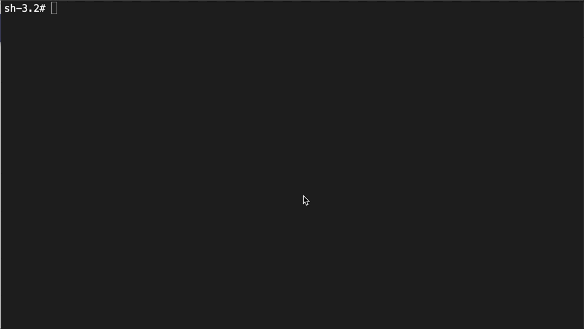
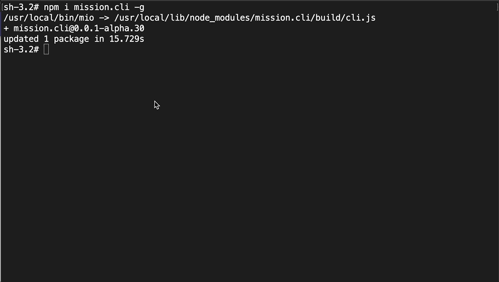

# Mission CLI Commands (mio)
---

## Install Mission Command Line Interface (CLI)
    npm i mission.cli -g

### Demo    

## mio new

S.No|Template Name |Command |Description |
:---|:---|:---|:---|
1| api| mio new api [app-name] | Create mission.api |
2| core| mio new core [app-name] | Create mission.core |
3| scheduler| mio new scheduler [app-name] | Create mission.scheduler |
4| mongodb| mio new mongodb [app-name] | Create mission.mongodb |
5| tsc| mio new tsc [app-name] | Create typescript quick start project |
6| client| mio new client [app-name] | Create Angular seed project `(inprogress)` |

### Demo

## mio init
Initialize the mission project. It will update or create `mission.json` file.

### Demo

## mio add

### Add new submodule by CLI
    mio add service petstore

### Demo

## mio list

## mio generage

## mio link (Deprecated in 1.0.0)

npm install` command will remove the link between the submodules and host modules. So we need to run `mio link` every exection of `npm install` or `npm i` command.

!!! danger "Warning"   
    `This command is deprecated in v1.0.0. Not required to run mio link anymore from v1.0.0.

## mio lint

## mio build

## mio serve

## mio docker

## mio version
View the mission cli version number
### Demo

## mio help